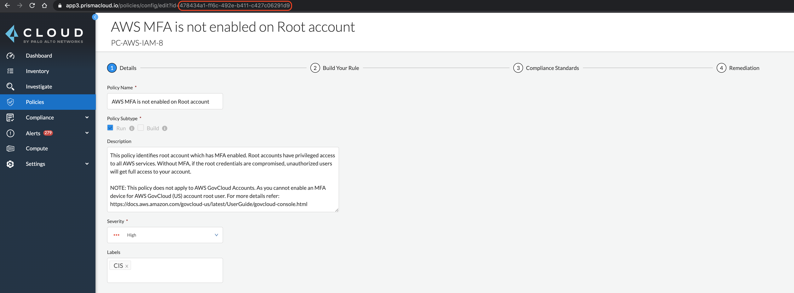

# Custom Runbook Development Guide

This guide covers the basics of creating and integrating your own runbooks to our Enhanced Remediation platform.
- [Prerequisites](#prerequisites)
- [Introduction](#introduction)
- [Developing your Runbook](#developing-your-runbook)
- [Integrating with Lambda](#integrating-with-lambda)
  - [Create a Custom Policy in Prisma Cloud](#create-a-custom-policy-in-prisma-cloud)
  - [Add your Runbook to AWS Lambda](#add-your-runbook-to-aws-lambda)
  - [(Optional) Add IAM Permissions](#optional-add-iam-permissions)
- [Testing your Runbook](#testing-your-runbook)

## Prerequisites

Basic familiarity with Python programming is required to build your own runbook.

## Introduction

Our runbooks use the AWS Python Software Development Kit (SDK) called `Boto`. According to their [docs](https://boto3.amazonaws.com/v1/documentation/api/latest/index.html#):

> Boto is the Amazon Web Services (AWS) SDK for Python. It enables Python developers to create, configure,
> and manage AWS services, such as EC2 and S3. Boto provides an easy to use, object-oriented API, as well
> as low-level access to AWS services.

## Developing your Runbook

To get started, you must first understand the architecture of how the Lambda parses alerts from Prisma Cloud, which is explained in the [Overview page](../README.md). Then, familiarize yourself with the `Boto` SDK by reading their [documentation](https://boto3.amazonaws.com/v1/documentation/api/latest/index.html#). Plan out what you want to do given the info available to you from the parsed alert. You can do virtually anything on AWS using `Boto`, so build the solution that works perfectly for you.

Be sure to note any IAM permissions you'll need in order for the Lambda to execute the runbook. You will have to add these permissions to the Lambda's role later.

## Integrating with Lambda

Once you've created your runbook, there are two main steps needed to integrate it with Lambda:

1. Create a custom policy in Prisma Cloud
2. Add your runbook to AWS Lambda

### Create a Custom Policy in Prisma Cloud

1. In the Prisma Cloud console, create a new custom policy by going to the **Policies** page.
2. Once created, go back to the **Policies** page and select your newly created policy.
3. In following the policy details page, note the Policy ID in the URL:


4. Copy this ID. This will be what is sent to AWS SQS in the alert payload and allows the Lambda to identify which policy triggered an alert.

### Add your Runbook to AWS Lambda

1. In the [AWS Lambda dashboard](https://us-west-2.console.aws.amazon.com/lambda/home?region=us-west-2#/functions), choose the Lambda you've already created using our CloudFormation template in the [setup guide](setup.md).
2. Under the section **Function code**, choose **File** → **New File**, and paste your runbook into the editor.
3. Choose **File** → **Save As...** and give your runbook an appropriate name (e.g. `AWS-EC2-555.py`) and **save it in the `runbooks` folder**. Make sure it's in this folder; otherwise, your runbook won't run!
4. Lastly, we must add the mapping from policy ID to your runbook filename. On the left-hand side of the editor, open `index_prisma.py`. Modify the `runbook_lookup` object to include your own mapping from custom policy ID to runbook name. The beginning of `index_prisma.py` should now look something like this:

```python
from __future__ import print_function
from importlib import import_module
from botocore.exceptions import ClientError
import boto3
import json
import os


# Prisma Cloud ID to old Evident ID

runbook_lookup = {
    '9a523950-7063-4cea-8742-599969ee0e98' : 'AWS-EC2-555', # This is your newly added runbook
    'c2b84f89-7ec8-473e-a6af-404feeeb96c5' : 'AWS-CLT-002',
    '0d07ac51-fbfe-44fe-8edb-3314c9995ee0' : 'AWS-CLT-004',
    '962e0daa-3c2d-4d79-9a5f-e0bf8fd4bb3b' : 'AWS-CLT-004',
    '38e3d3cf-b694-46ec-8bd2-8f02194b5040' : 'AWS-CLT-005',
    'b76ad441-e715-4fd0-bbc3-cd3b2bee34bf' : 'AWS-CLT-006',
    # ... and so on.
```

5. Congrats! You have successfully integrated your own custom runbook. If you want to contribute it to the community, check out our [Contributing](../../CONTRIBUTING.md) guidelines and make a pull request with your script.

### (Optional) Add IAM Permissions

If your runbook requires extra IAM permissions beyond those specified at installation, do the following to grant those permissions to Lambda:

1. Go to the [AWS IAM Dashboard](https://console.aws.amazon.com/iam/home?region=us-west-2#/home) and select **Roles**.
2. Search for `PrismaRemediation`. The role name should be called `PrismaRemediation-LambdaRole-[random characters]`.
3. Under the **Permissions** tab, find the policy called `PrismaRemediation` and click **Edit policy**. These are the permissions you will modify:

5. Add the extra IAM permissions using either the Visual editor or the JSON itself, then click **Review policy**.
6. Review the resulting policy and click **Save changes**.
7. If you have child accounts whose IAM permissions you would like to modify, repeat steps 1-6 but search for the role called `CrossAccountRemediationRole` instead.

Note: If you have many child accounts, it will be difficult to modify the IAM policies manually for each account. If this is the case for you, we recommend downloading the CloudFormation templates directly (download the parent template [here](../templates/cloudformation_prisma_template.json) and the child template [here](../templates/cloudformation_role_template.json)), modifying them using a text editor, and then deploying those instead.

After you press the **Launch Stack** buttons above, choose **Upload a template file** and choose the respective modified CloudFormation template. Doing this will deploy everything identically as before, but with your IAM permission modifications.

## Testing your Runbook

To test your runbook, simply include your custom policy in the Alert Rule you created in the [setup guide](setup.md) that integrates with Lambda. The runbook should now execute whenever that custom policy generates an alert.
