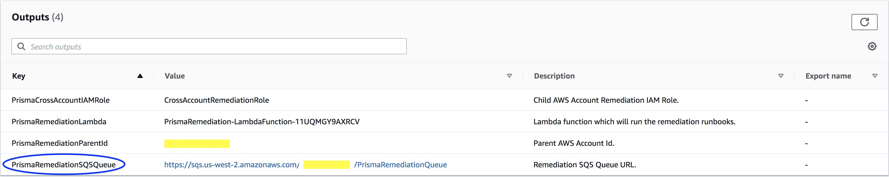
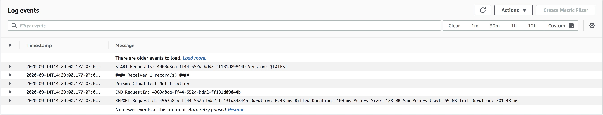
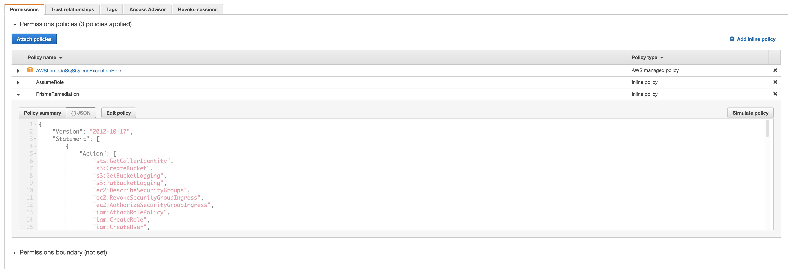

# Setup Guide - AWS

## Overview

1. Build the Lambda remediation infrastructure using a CloudFormation template in your Parent AWS account.
2. (Optional) Create an IAM Role and Policy in target (Child) AWS accounts using a different CloudFormation template.
3. Integrate Prisma Cloud to send alerts to the Lambda remediation infrastructure.
4. (Optional) Test the Lambda
5. (Optional) Update out-of-the-box runbooks
6. (Optional) Edit IAM permissions
7. Create your own custom Lambdas

---

## Step 1 - Create Prisma Cloud Remediation Stack

Click the **Launch Stack** button and change the region on the upper right hand corner to the one you want to deploy your Lambda to:

This CloudFormation stack creates the following resources in the chosen region:

- **AWS SQS Queue**: receives alerts from Prisma Cloud and triggers the Lambda.
- **AWS IAM Role and Policy**: used by the Lambda (See [iam_role_permission.json](../templates/iam_role_permission.json) for a list of all permissions).
- **AWS Lambda package**: contains the runbook scripts to remediate Prisma Cloud alerts.

## Step 2 - Setup IAM Permissions

### Single Account Setup

To remediate a single AWS account, you're done. You can skip this step and move on to **Step 3 - Prisma Cloud Integration**.

### Multi Account Setup

The account where the stack is launched (in Step 1) can be considered the **Parent** account.  All other accounts are called **Child** or **Target** accounts.

The Parent account will need permission to change/modify AWS resources in your Child account(s).  To do this, we'll create a Role that allows the Lambda function to perform the remediation.

When you created the CloudFormation stack in Step 1, one of the parameters was called `CrossAccountRoleName` (The default value of that parameter is `CrossAccountRemediationRole`). Use the same name when using the CloudFormation template below to create the IAM Role in your Child account(s).

For Multi Account Setup, you will need to create this IAM Role in each Child/Target AWS account by launching the following CloudFormation template (in AWS, choose your region on the upper right hand corner):

When you get to the **Specify stack details** page, ensure that you replace the `AWSParentAccountId` paramater value to match the [**Parent** account's AWS ID](https://console.aws.amazon.com/billing/home?#/account).

This CloudFormation stack creates the following resources in the chosen region:

- AWS IAM Role and Policy to be used by Lambda (See [iam_role_permission.json](../templates/iam_role_permission.json) for a list of all permissions).

## Step 3 - Prisma Cloud Integration

You will need to get the **PrismaRemediationSQSQueue** URL from the Output section of the CloudFormation stack created in step 1.

- Go to the [AWS CloudFormation Dashboard](https://us-west-2.console.aws.amazon.com/cloudformation).
- Click on the Prisma Remediation stack name.
- Select the **Outputs** tab.
- Take note of the **PrismaRemediationSQSQueue** URL.

Create a new Prisma Cloud Integration:

- Login to the Prisma Cloud console.
- From the left-side window pane, select **Settings**.
- Choose **Integrations**.
- Near the top of the window, click **Add New**.
- Fill out the **Integration Name** and **Queue URL** fields, then click Next.  Use the SQS Queue URL from the Output of your CloudFormation stack.
- Click **Test**. You should receive a Success message. If not, double check your URL.
- **Save** your new integration.

At this point, the remediation infrastructure setup is complete. Let's now verify that the integration is working.

Check CloudWatch Logs:

- Go to the [AWS Lambda Dashboard](https://us-west-2.console.aws.amazon.com/lambda).
- Click on your Function name.
- Near the top of the next screen, select the **Monitoring** tab.
- Choose **View logs in CloudWatch** near the the top right-hand side of the screen.
- From the new window/tab, click on the latest new log stream.  You should see a test message from Prisma Cloud, sent from your SQS Queue integration test, similar to the one below.

- If you don't see the Prisma Cloud test message, or an error occurred, check out **Testing Lambda**.

Create a new Prisma Cloud Alert Rule:

- Login to the Prisma Cloud console.
- From the left-side window pane, slect **Alerts**.
- Choose **Alert Rules**.
- Near the top of the window, click **Add New**.
- Fill out the **Alert Rule Name** field, then click **Next**.
- Select the account group(s), and **Next**. These are the AWS accounts you're setting up for auto-remediation.
- Choose the policies you'd like to auto-remediate, then click **Next**.
- Enable the **Amazon SQS** alert notification and select the integration you created above.
- Save your new alert rule.

## Step 4 - (Optional) Test the Lambda

The base remediation package comes with a test runbook called [AWS-TEST-001.py](../lambda_package/runbooks/AWS-TEST-001.py). At the top of the runbook, in the comment section, there is a sample SQS message that you can use to test your setup.

- Go to the [AWS Lambda Dashboard](https://us-west-2.console.aws.amazon.com/lambda).
- Click on the Function name.
- At the top of the screen, just to the left of the **Test** button, click **Select a test event** and then **Configure test events**.
- Ensure that **Create new test event** is selected along with the `hello-world` **Event template**.
- Replace the test event's contents with the sample SQS message found in the comment section of the `AWS-TEST-001` runbook. Be sure to replace `123456789012` in the `accountId` field with your **Parent** AWS account ID. We can call this event `TargetSelf`.
- Click **Create** then **Test**.

Under the **Execution result** alert, click **Details** and you will see:

- `This runbook is invoked by arn:aws:lambda:<region>:<parent_account_name>:function:<lambda_function_name>`
followed by the output of `sts.get_caller_identity()`. You will notice that the `Arn` uses the credential from the Lambda role.

For multi-account setup, repeat all the above steps, but replace `123456789012` in the `accountId` field with your **Child** AWS account ID.

Under the **Execution result** alert, click **Details** and you will see:

- `This runbook is invoked by arn:aws:lambda:<region>:<parent_account_name>:function:<lambda_function_name>`
followed by the output of `sts.get_caller_identity()`. You will notice that the `Arn` uses the assumed role on another account.

## Step 5 - (Optional) Update Out-of-the-Box Runbooks

Updates to this GitHub repository are periodically packaged into releases and hosted by Palo Alto Networks. If a new release is available ([check here for our releases](../releases); the latest release will always be equivalent to the release with the latest date) and you would like to update your Lambda package with the latest out-of-the-box runbooks, do the following:

1. Go to the [AWS CloudFormation Dashboard](https://us-west-2.console.aws.amazon.com/cloudformation) and select **PrismaRemediation**.
2. Click **Update**.
3. Click **Use current template** and choose **Next** three times.
4. Check off the acknowledgement at the bottom, then click **Update stack**. Your Lambda package is now updated with the latest runbooks!

## Step 6 - (Optional) Edit IAM Permissions

If there are any runbooks that are either overpermissive or don't suit your environment, you can remove them after installation.

1. Check the [runbook details](../lambda_package/runbook_details.md) page and see what IAM permissions each runbook requires. Identify the ones you do not need.
2. Go to the [AWS IAM Dashboard](https://console.aws.amazon.com/iam/home?region=us-west-2#/home) and select **Roles**.
3. Search for `PrismaRemediation`. The role name should be called `PrismaRemediation-LambdaRole-[random characters]`.
4. Under the **Permissions** tab, find the policy called `PrismaRemediation` and click **Edit policy**. These are the permissions you will modify:

5. Remove any necessary IAM permissions using either the Visual editor or the JSON itself, then click **Review policy**.
6. Review the resulting policy and click **Save changes**.
7. If you have child accounts whose IAM permissions you would like to modify, repeat steps 1-6 but search for the role called `CrossAccountRemediationRole` instead.

### Editing IAM permissions for a large number of accounts

If you have many child accounts, it will be difficult to modify the IAM policies manually for each account. If this is the case for you, we recommend downloading the CloudFormation templates directly (download the parent template [here](../templates/cloudformation_prisma_template.json) and the child template [here](../templates/cloudformation_role_template.json)), modifying them using a text editor, and then deploying those instead.

After you press the **Launch Stack** buttons above, choose **Upload a template file** and choose the respective modified CloudFormation template. Doing this will deploy everything identically as before, but with your IAM permission modifications.

## Step 7 - Create Your Own Custom Lambdas

We built this package as a starting point for our customers in building their custom auto-remediation solutions. Feel free to examine any of the out-of-the-box runbooks and use them as examples to guide you in building the perfect auto-remediation solution that fits your needs.

To better understand the how the Lambda package parses alerts from Prisma Cloud, check out the [AWS Lambda remediation overview](../README.md) for a detailed breakdown and explanation. This resource also includes info on how to start creating your own custom runbooks.

If you build any runbooks that you think may help the rest of the community, feel free to make a pull request! This project is intentionally open-source as we want this to be community-driven. Please see our [CONTRIBUTING.md](../../CONTRIBUTING.md) document for more details on how to contribute.

Community-created runbooks, once reviewed by our developer team, will be added to this repo in a separate folder. They will **not** be included in our release packages and will instead have to be installed manually. This is a security measure as there may always be risk in using third-party code.
